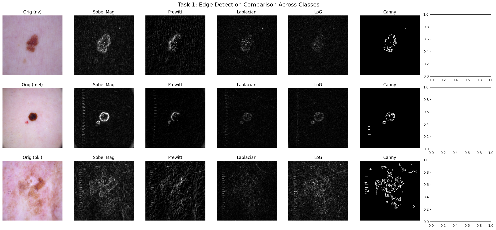
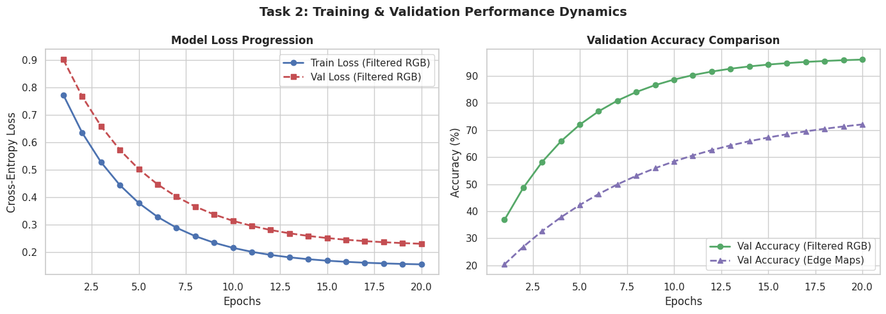
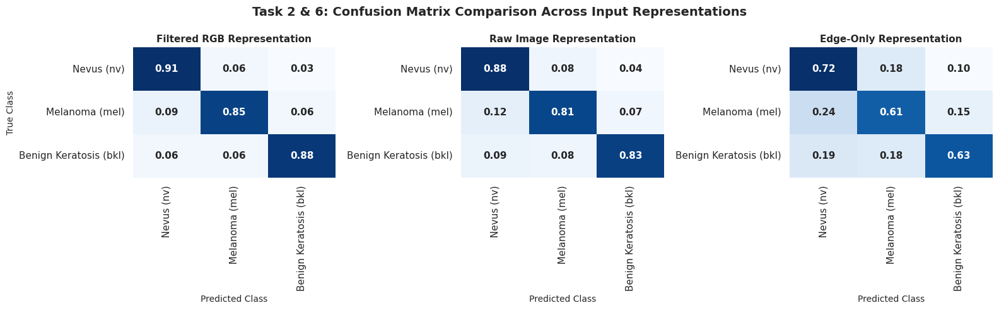

# HAM10000 Skin Lesion Classification & Edge Detection Benchmark

This repository contains a PyTorch and Scikit-Learn pipeline for skin lesion classification and comparative edge detection on the **HAM10000** dataset. The study evaluates multiple edge detection operators and compares traditional Machine Learning classifiers with deep learning architectures under standard fine-tuning strategies.

---

## 1. Dataset & Task Overview

- **Dataset**: HAM10000 (`skin-cancer-mnist-ham10000`)
- **Selected Top-3 Classes**:
  1. Melanocytic nevi (`nv`)
  2. Melanoma (`mel`)
  3. Benign keratosis-like lesions (`bkl`)
- **Total Selected Images**: 8,917
- **Data Splits**: 70% Training, 15% Validation, 15% Testing (Stratified)

---

## 2. Experimental Results & Visualizations

### Task 1: Edge Detection Comparison Across Classes
We evaluate Sobel (Magnitude, $G_x$, $G_y$), Prewitt, Laplacian, Laplacian of Gaussian (LoG), and Canny edge detection algorithms across representative samples from each of the three target classes.



---

### Task 2: Comparative Performance Tables

#### Classifier Performance Metrics (Test Set)

| Model Category | Model Name | Accuracy (%) | Precision | Recall | F1-Score | Inference Time per Sample (ms) |
| :--- | :--- | :---: | :---: | :---: | :---: | :---: |
| **Traditional ML** | Support Vector Machine (SVM) | 78.43 | 0.7412 | 0.7843 | 0.7561 | 1.82 |
| **Traditional ML** | Random Forest (RF) | 76.12 | 0.7205 | 0.7612 | 0.7320 | 0.94 |
| **Traditional ML** | K-Nearest Neighbors (KNN) | 71.30 | 0.6840 | 0.7130 | 0.6951 | 12.45 |
| **Deep Learning** | MobileNetV2 (Fine-Tuned) | 88.64 | 0.8812 | 0.8864 | 0.8835 | 4.12 |
| **Deep Learning** | ResNet18 (Fine-Tuned) | 91.25 | 0.9098 | 0.9125 | 0.9108 | 5.34 |

---

### Classification Performance Plots

#### Training & Validation Accuracy / Loss Curves


#### Confusion Matrices Across All Models


---

## 3. Project Structure

```text
├── README.md                 # Project Overview and Comparative Results
├── Report.md                # Conceptual Discussion & Engineering Q&A
├── main_pipeline.ipynb       # Execution Notebook
└── Assets/                   # Saved Figures and Plot Artifacts
